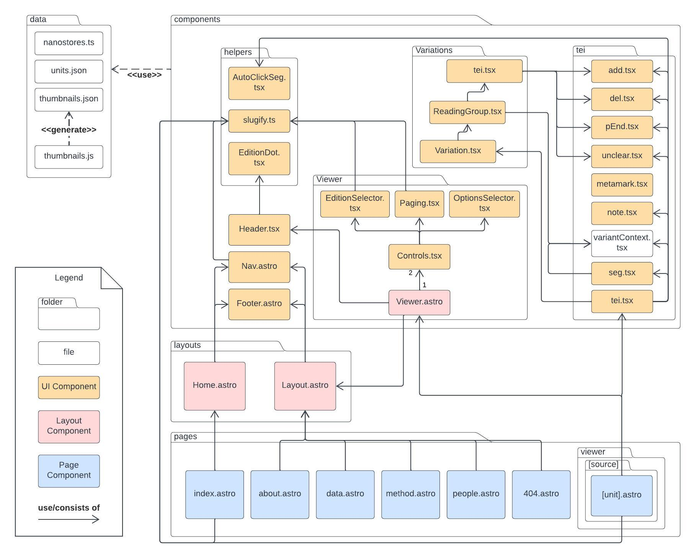
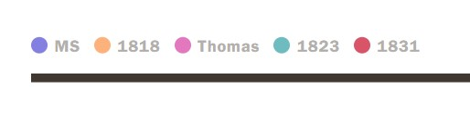
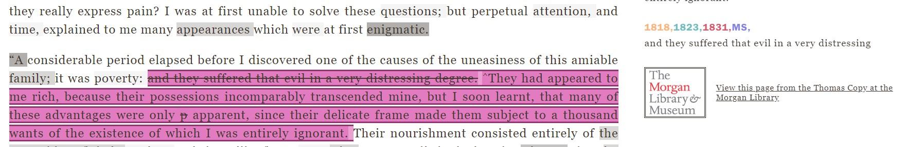

# Frankenstein Variorum Project (fv-web)

## :desktop_computer:Environment Setup

   

To run this project locally, run:

```shell
pnpm install
pnpm dev
```

## :memo:Commands

All commands are run from the root of the project, from a terminal:

| Command                 | Action                                           |
| :---------------------- | :----------------------------------------------- |
| `pnpm install`          | Installs dependencies                            |
| `pnpm dev`              | Starts local dev server at `localhost:3000`      |
| `pnpm build`            | Build your production site to `./dist/`          |
| `pnpm preview`          | Preview your build locally, before deploying     |
| `pnpm run astro ...`    | Run CLI commands like `astro add`, `astro check` |
| `pnpm run astro --help` | Get help using the Astro CLI                     |

## :card_index_dividers: Project Structure

Inside Frankenstein Variorum Project (fv-web), you'll see the following folders and files:

```shell
/
├── dist/                # Compiled static files for production use
├── public/              # Public assets like images, fonts, etc.
├── src/                 # Source code folder
│   ├── components/      # Reusable UI components
│   ├── layouts/         # Page layout templates
│   │   └── ... 
│   ├── pages/           # Project's pages like home, about, method...
│   │   └── index.astro  # Homepage file
│   │   └──...
│   └─ data/             # Storing static project-related data
│   	└── ...
├── package.json         # Project dependencies and scripts configuration
├── package-lock.json    # Locks the versions of dependencies for consistency
├── astro.config.mjs     # Configuration file for the Astro project
├── tailwind.config.js   # Configuration file for Tailwind CSS
├── tsconfig.json        # TypeScript project configuration
└── ...                  
```

### Component Relationships Overview

These two diagrams (figure 1 & 2) below illustrate the relationships and dependencies between the components within the project. Each component is modular and reusable. 



*Figure 1: Component Relationships*

Figure 1 illustrates the structure and interactions between the various UI components, layouts, and pages in the project. 

**UI Component Folder (`components/`)**:

Contains components used to construct the Variorum Viewer page. 

- Variorum Viewer Component Folder (**`Viewer/`**):

  Contains control panel and Viewer layout. 

- Variation Component Folder (**`Variations/`**):

  Regards right side panel which showing variorum data among reading groups.

- TEI Component Folder (**`tei/`**):

  Contains TEI components used in the side panel.

  - **`Seg.tsx`**: the critical component with interactive functionalities
    - Dynamic Highlighting: Toggles the highlighting of the selected segment based on user interaction and URL hash.
    - Variant Intensity: Reflects the number of differences among editions using different shades of grey, with darker shades representing more significant textual differences.
    - Interactive Sidebar Integration: Updates the sidebar with the selected segment's variorum data.
    - External Links: Generates external links for MS and Thomas editions, providing relevant resources based on the segment and the edition.

- Helpers Folder (**`helpers/`**):

  Each component provides specific functionality. 

  - **`AutoClickSeg.tsx`**:  automatically highlights the corresponding `<seg>` element in the viewer and displays the side panel when the user click on the edition link in the side panel and navigate to the target page

  - **`slugify.ts`**:   takes a string as input, replaces spaces with underscores (`_`), and converts all characters to lowercase.

    Example:

    ```javascript
    slugify("Edition Selector Page"); 
    // Output: "edition_selector_page"
    ```

  - **`EditionDot.tsx`**: add dots with specific color before edition name. 

    

    *Figure 1.1: edition dots in `Header.tsx` Component* 

**Layout Component Folder (layouts/):**

Contains page templates with a UI structure. 

- **`Home.astro`**: the template only for the home page`index.astro`.
- **`Layout.astro`**: the template for others page.

**Page Component Folder (pages/):**

Contains all pages and sub-pages in the app.

- **`Viewer/[source]/[unit].astro`**: the component applying Astro [dynamic routes](https://docs.astro.build/en/guides/routing/#dynamic-routes) to construct all variorum viewer pages.

--------

.jpeg)

*Figure 2: Component Interaction with Data*

Figure 2 shows how the components from Figure 1 interact with the data stored in the `data` folder. Each component that requires data pulls it from files stored in the `data` directory, ensuring a clear separation between data handling and UI rendering.

**Data Folder (`data/`)**:
Contains files that provide content to the components.

- **`nanostores.ts`**:
  A TypeScript file that manages state using [Nanostores](https://github.com/nanostores/nanostores), a small state manager. This file is to handle the share states across various components. 
  
  - The `EditionSelector` component uses `nanostores.ts` to access the global app state. When a user selects a new edition, it checks the current chunk and finds the corresponding unit. If the unit isn’t available, it selects the first available one. The component then updates the URL to display the new edition and ensures the app state stays consistent.
  - `OptionsSelector` interact with `nanostores.ts` to manage and synchronize state across the app, such as edition/chapter data and user preference like show/hide variants/text/note.
  - `ReadingGroup`, `Variation`, `note`, and `seg` read state from `nanostores.ts` to maintain consistent user interface behavior and/or to fetch correct variorum data.  
  
- **`units.json`**:
  A JSON file containing data related to entries (e.g., source (edition), unit (chapter), chunk #, and app #) in this project. 

  - Components like `EditionSelector` and `Paging` would pull data from `units.json` to dynamically update available chapters according to the current edition chosen.
  - `Header` and `Nav` generate the start page link of the variorum viewer via `nanostores.ts`

- **`thumbnails.json`**:
  Contains URL data for site page from the Thomas Copy at the Morgan Library. Components like `components.tei.seg`  may fetch data from `thumbnails.json` to navigate to relevant thumbnails alongside their content. 
  
  *Figure 2.1: the thumbnails link available only while meeting `add` or `del` on Thomas Page*

- **`thumbnails.js`**: 

  Generates the JSON file `thumbnails.json` which includes all data helps to construct the Thomas Copy link. Run `node thumbnails.js` in `data/` folder.

## :arrows_counterclockwise:Workflow When Doing a Complete Collation Update

1. push to `postCollation` main branch

2. push to `fv-data` main branch

3. run the XSLT `chap-chunk-alignments/interfaceStructureInfo.xsl` in `fv-data` to generate `units.json` 

4. import `units.json` to `fv-web` (goes to `src/data/units.json` )

5. push to `fv-web`

